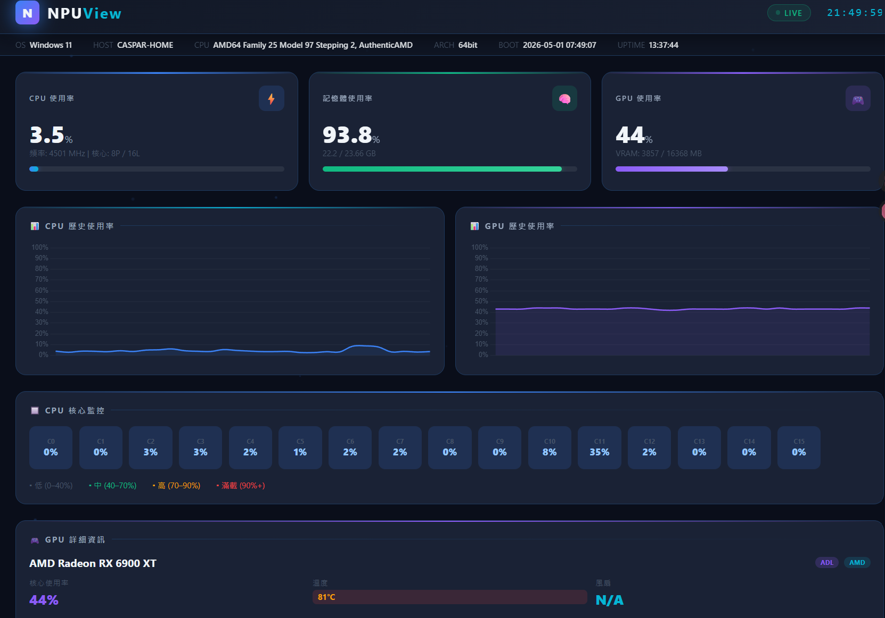

# NPUView — System Monitor

以 Python Flask + Socket.IO 建立的本機硬體監控儀表板，透過瀏覽器即時查看 CPU、GPU、記憶體、磁碟、網路等系統資訊，每 2 秒自動更新。

---

## 功能

| 類別 | 資訊 |
|------|------|
| CPU  | 使用率、每核心使用率、時脈頻率 |
| GPU  | 使用率、VRAM、溫度、功耗、核心/記憶體時脈（支援 NVIDIA / AMD / Intel） |
| 記憶體 | 實體記憶體、虛擬記憶體 (Swap) 使用量 |
| 磁碟 | 各磁碟分割使用率與容量 |
| 網路 | 即時上傳/下載速率、封包統計 |
| 系統 | OS 版本、主機名稱、CPU 型號、開機時間、執行時間 |

---

## 支援硬體

| 廠牌 | API | 備註 |
|------|-----|------|
| NVIDIA | pynvml | GeForce / RTX / Quadro |
| AMD | ADL (atiadlxx.dll) + PMLog | RX 5000 / 6000 / 7000 系列 |
| Intel | WMI | 整合顯示卡 |

---

## 快速開始

### 需求

- Windows 10 / 11（64-bit）
- Python 3.9+
- （選用）[HWiNFO64](https://www.hwinfo.com/) 或 [LibreHardwareMonitor](https://github.com/LibreHardwareMonitor/LibreHardwareMonitor) — 用於 CPU 溫度讀取

### 安裝與啟動

**方式一：批次檔（雙擊啟動）**

```bat
start_npuview.bat
```

**方式二：PowerShell**

```powershell
.\start_npuview.ps1
```

> 兩個腳本皆會：
> 1. 自動切換到專案目錄
> 2. 優先使用 `.venv` 虛擬環境
> 3. 若缺少套件，自動從 `requirements.txt` 安裝

**方式三：手動**

```powershell
# 建立虛擬環境（第一次）
python -m venv .venv
.venv\Scripts\Activate.ps1
pip install -r requirements.txt

# 啟動
python app.py
```

啟動後開啟瀏覽器前往：

```
http://localhost:2700
```

---

## CPU 溫度

Windows 限制一般程式無法直接讀取 CPU 溫度感測器。若要顯示 CPU 溫度，請先啟動以下任一工具（無需保持前景視窗開啟）：

| 工具 | 偵測方式 | 備註 |
|------|----------|------|
| **LibreHardwareMonitor** | WMI `root\LibreHardwareMonitor` | 建議以系統管理員執行 |
| **OpenHardwareMonitor** | WMI `root\OpenHardwareMonitor` | 較舊但輕量 |
| **HWiNFO64** | Shared Memory `HWiNFO_SENS_SM2` | 需在設定中啟用 Shared Memory Support |

NPUView 啟動後會每 30 秒自動重新偵測，無需重啟即可自動切換至可用來源。

---

## 專案結構

```
NPUView/
├── app.py                  # Flask 主程式、Socket.IO 路由、背景收集執行緒
├── hardware_provider.py    # 硬體抽象層：自動偵測並呼叫對應 GPU/CPU API
├── requirements.txt        # Python 套件清單
├── start_npuview.bat       # 一鍵啟動（批次檔）
├── start_npuview.ps1       # 一鍵啟動（PowerShell）
└── templates/
    └── index.html          # 前端介面（Chart.js + Socket.IO）
```

---

## 套件說明

| 套件 | 用途 |
|------|------|
| `flask` | Web 框架 |
| `flask-socketio` | WebSocket 即時推送 |
| `psutil` | CPU / 記憶體 / 磁碟 / 網路資訊 |
| `pynvml` | NVIDIA GPU 資訊 |
| `GPUtil` | NVIDIA GPU 輔助 |
| `pywin32` | Windows API / WMI 存取 |
| `wmi` | WMI 查詢（GPU、CPU 溫度來源偵測） |
| `eventlet` | 非同步支援（保留相容性） |
